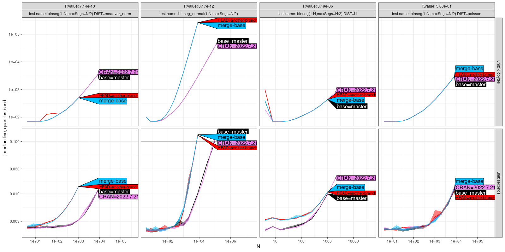
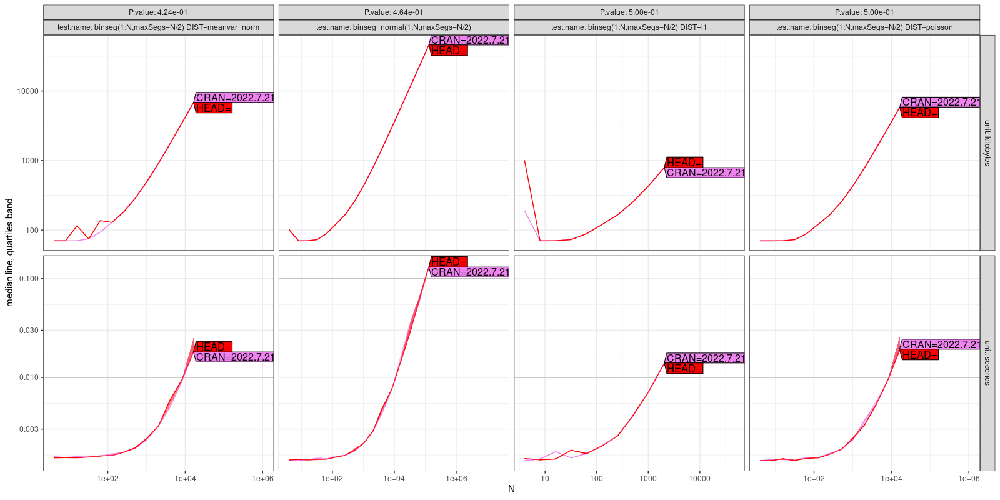
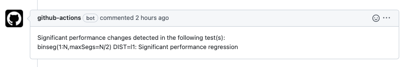

# GitHub Action r-asymptotic-testing
Perform asymptotic testing on your R package upon every push/pull request!

This GitHub Action will run the tests in `inst/atime/tests.R` by `atime::atime_pkg`, on different versions of the package (HEAD vs base, or HEAD vs CRAN) with various input data sizes, apply t test on the test results, upload plots of the test results, and leave messages in the PR if significant performance regression or improvements are detected.

## User Guide
### Prerequisites
1. First, you need to write some tests in your `inst/atime/tests.R`, which defines `test.list`, a list with names corresponding to different tests. Each element should be a list with named elements `N` `setup`, `expr`, to be passed as named arguments to `atime::atime_versions`. [This](https://github.com/tdhock/binsegRcpp/blob/5e5e1349304238b6d20b55dff236989caafec239/inst/atime/tests.R) is an example of the `inst/atime/tests.R`.
2. If you want the GitHub Action to be used to leave messages in pull requests, you need to toggle on the Workflow write permission. In your GitHub repository, go to settings > Actions > Workflow permissions > choose "Read and write permissions".

### Inputs
There is one input `alpha` that you can specify. This is the significance threshold to report performance changes, used in Welch Two Sample t-test to compare with its p value. It should be an R expression, so it may need to be quoted by a double quote and then a single quote. It should be a value between 0 and 1. The higher it is, the easier it will report significant changes. The default value is 1e-3.
Here is an example:
```yml
steps:
  - uses: SiyaoIsHiding/r-asymptotic-testing@v1
    with:
      alpha: '"0.1"'
```

### Output
There will always be a zip file as an uploaded artifact at the bottom of the Action run result summary page. This zip file will contain the plots of the test results for each individual test expression, as well as a summary of all test results in `tests_all_facet.png`.

* If the Action is triggered by a **pull request**:

  Tests will run on four versions: base (usually the master/main), HEAD (usually another branch), merge-base, and CRAN. All of them will show up in the plots, but **only base and HEAD** will be considered and compared when deciding whether to report a detection of significant performance changes.

  Here is an example of the plot of all test results, `tests_all_facet.png`.
  
  * And if there are **siginificant performance** changes detected:
    You can find a `test_result.txt` file in the uploaded artifact. The content looks like this:
    ```txt
    Significant performance changes detected in the following test(s):
    binseg(1:N,maxSegs=N/2) DIST=l1: Significant performance regression
    ```
* If the Action is triggered by a **push**:
  
  Tests will run on only two versions, HEAD and CRAN. Also, HEAD will be compared with CRAN to detect significant performance changes.

  Here is an example of the plot of all test results, `tests_all_facet.png`.
  

  * And if there are **siginificant performance** changes detected**:
  
    The GitHub Actions bot will leave a message in your pull request.
    
    And you will also be able to find a `test_result.txt` file in the uploaded artifact with the same content.

## Example of Usage
### Example Workflow Definition

This is an example of what can be put into `.github/workflows/Atime-Pkg.yml`
```yml
on:
  push:
    branches: [main, master]
  pull_request:
    branches: [main, master]

name: Atime-Pkg

jobs:
  Atime-Pkg:
    runs-on: ubuntu-latest
    env:
      GITHUB_PAT: ${{ secrets.GITHUB_TOKEN }}
      R_KEEP_PKG_SOURCE: yes
    steps:
      - uses: SiyaoIsHiding/r-asymptotic-testing@v1
        with:
          alpha: '"0.1"'
```
### Example Repositories 
[Here](https://github.com/SiyaoIsHiding/binsegRcpp) is an example repository using this GitHub Action, which is the R package `binsegRcpp`, in which 
* [Here](https://github.com/SiyaoIsHiding/binsegRcpp/blob/main/inst/atime/tests.R) is the file of the tests defined.
* [Here](https://github.com/SiyaoIsHiding/binsegRcpp/pull/4) is the pull request with a message reporting significant performance regression. 
* [Here](https://github.com/SiyaoIsHiding/binsegRcpp/actions/runs/4474255237) is the Action run result summary page, where you can download the uploaded artifact.


