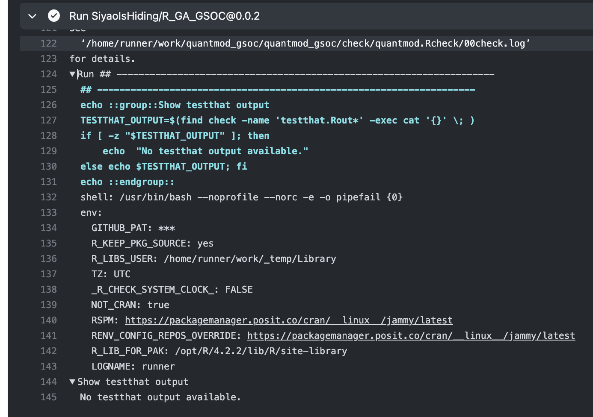
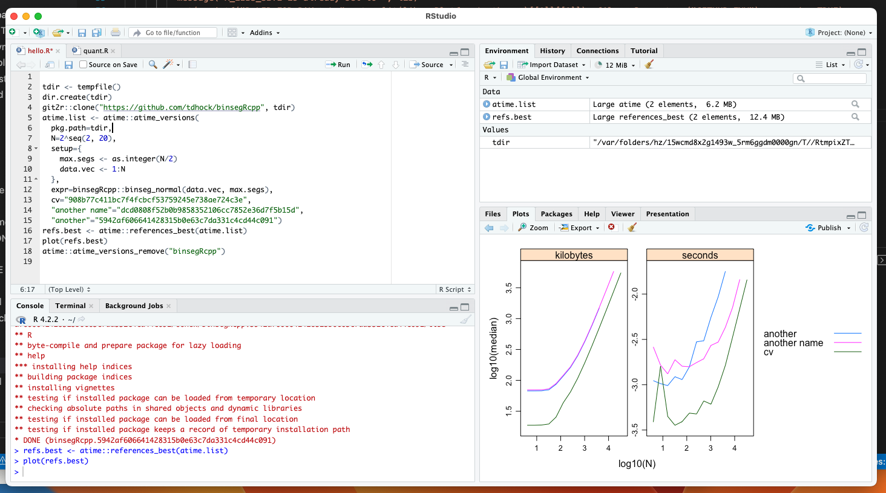

# R_GA_GSOC
For the R GSOC project [Github action for atime](https://github.com/rstats-gsoc/gsoc2023/wiki/Github%20action%20for%20atime)

The testing repo using this Github Action is [here](https://github.com/SiyaoIsHiding/quantmod_gsoc).
+ [Milestones](#milestones)
  + [Easy \& Medium Task](#easy--medium-task)
  + [Hard Task](#hard-task)
  + [Current Progress](#current-progress)
  + [To-Do List](#to-do-list)
+ [Questions To Ask](#questions-to-ask)
  + [**Where should I install the binsegRcpp?**](#where-should-i-install-the-binsegrcpp)
  + [**Packaged with r-lib/actions/setup-r and r-lib/actions/setup-r-dependencies in it or not?**](#packaged-with-r-libactionssetup-r-and-r-libactionssetup-r-dependencies-in-it-or-not)
  + [**Using actions/check-out or git2r?**](#using-actionscheck-out-or-git2r)
  + [**How to test?**](#how-to-test)
  + [**I failed to find `atime_pkg()`... Where can I find it?**](#i-failed-to-find-atime_pkg-where-can-i-find-it)

## Milestones
### Easy & Medium Task
I modified the R Github Action [check-r-package](https://github.com/r-lib/actions/tree/v2/check-r-package) so that it will log out "No testthat output available" if there is no testthat output.

The original code snippet:
```bash
find check -name 'testthat.Rout*' -exec cat '{}' \; || true
```

My modified one:
```bash
TESTTHAT_OUTPUT=$(find check -name 'testthat.Rout*' -exec cat '{}' \; )
if [ -z "$TESTTHAT_OUTPUT" ]; then
    echo  "No testthat output available."
else
    echo $TESTTHAT_OUTPUT
fi
```

The [commit of this repo](https://github.com/SiyaoIsHiding/R_GA_GSOC/tree/af91fff737e65a228cbf91758fcf3a4718fc39b8) in the medium task. The [commit of the testing repo](https://github.com/SiyaoIsHiding/quantmod_gsoc/tree/d3d46658693df688965ec160430ae1e65dc5f167) using this action in the medium task.

The screenshot with the `No testthat output available` at the end.

### Hard Task

Using the example code in the atime package documentation to test the performance of `binsegRcpp::binseg_normal`

### Current Progress
Hardcoded the `atime_versions()` in to GitHub Action shell script and ensured the repository using it can run it without error.
The hardcoded script looks like this:
```yaml
    - name: Check
      id: rcmdcheck    
      env:
        _R_CHECK_CRAN_INCOMING_: false
      run: |
        ## --------------------------------------------------------------------
        options(crayon.enabled = TRUE)
        cat("LOGNAME=", Sys.info()[["user"]], "\n", sep = "", file = Sys.getenv("GITHUB_ENV"), append = TRUE)
        if (Sys.getenv("_R_CHECK_FORCE_SUGGESTS_", "") == "") Sys.setenv("_R_CHECK_FORCE_SUGGESTS_" = "false")
        cat("check-dir-path=", file.path(getwd(), (${{ inputs.check-dir }})), "\n", file = Sys.getenv("GITHUB_OUTPUT"), sep = "", append = TRUE)
        check_results <- rcmdcheck::rcmdcheck(args = (${{ inputs.args }}), build_args = (${{ inputs.build_args }}), error_on = (${{ inputs.error-on }}), check_dir = (${{ inputs.check-dir }}))
      
        tdir <- tempfile()
        dir.create(tdir)
        git2r::clone("https://github.com/tdhock/binsegRcpp", tdir)
        atime.list <- atime::atime_versions(
          pkg.path=tdir,
          N=2^seq(2, 20),
          setup={
            max.segs <- as.integer(N/2)
            data.vec <- 1:N
          },
          expr=binsegRcpp::binseg_normal(data.vec, max.segs),
          cv="908b77c411bc7f4fcbcf53759245e738ae724c3e",
          "another name"="dcd0808f52b0b9858352106cc7852e36d7f5b15d",
          "another"="5942af606641428315b0e63c7da331c4cd44c091")
        refs.best <- atime::references_best(atime.list)
        plot(refs.best)
        atime::atime_versions_remove("binsegRcpp")
        
      shell: Rscript {0}
      working-directory: ${{ inputs.working-directory }}
```

### To-Do List
1. Migrate from `atime_versions` to `atime_pkg` if I finally find it.
2. Access the source code and the recent commit IDs through environment variables.
3. Upload the plots by `actions/upload-artifact` and verify they are correct.
4. Leave messages in PR.
5. Implement the functionality of comparing the performance between commits.

## Questions To Ask

### **Where should I install the binsegRcpp?**
When I am testing locally, I find that I have to install `binsegRcpp` beforehand by `install.packages("binsegRcpp")`, otherwise the script cannot compile, raising `Error in loadNamespace(x) : there is no package called ‘binsegRcpp’`. Therefore, in the hardcoded Github Action above, I have to install `binsegRcpp` during the `setup-r-dependencies` beforehand as well. But is it supposed to use `atime` like this?


### **Packaged with r-lib/actions/setup-r and r-lib/actions/setup-r-dependencies in it or not?**
If not packaged in it, the user has to specify atime in their `r-lib/actions/setup-r-dependencies`. If packaged, there will be less flexibility for the user.


### **Using actions/check-out or git2r?**
Both are probably feasible. Using `actions/check-out` will enable the private repositories to use the Github Action, but result in more configuration tasks.


### **How to test?**
I find that the plots can be significantly different even on the same commits. I cannot come up with an ideal plan of testing. A potential plan is to delibrately add some codes to slow down the performance, for example sleeping for a while and then compare the changes in performance. But still, it won't be 100% sure that my codes are working.

### **I failed to find `atime_pkg()`... Where can I find it?**

